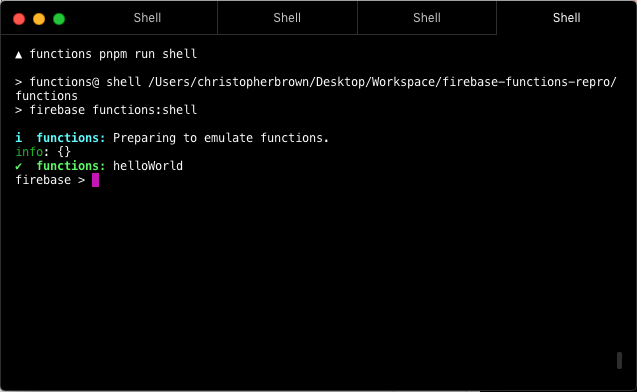
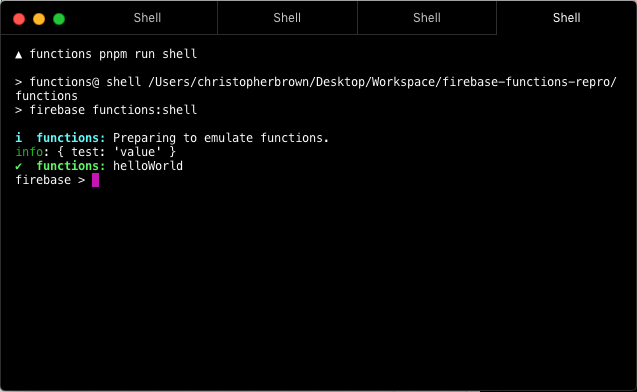

# Repro steps

1. `firebase init functions`
2. `cd functions`
3. `pnpm i` and `pnpm i firebase-tools@6.8.0`
4. Some packages may be missing due to the way that pnpm flattens packages, you'll need to install those. You can view the devDependencies in [`functions/package.json`](/functions/package.json) to see what you need.
5. Create a `.runtimeconfig.json` file with the following contents:

```json
{
  "test": "value"
}
```

6. In the `functions/index.js` file you'll want to do the following after importing `functions` from `firebase-functions`:

```js
console.log(functions.config());
```

7. Uncomment the example that already exists in the `index.js` file to allow `firebase functions:shell` to run properly
8. Run `pnpm run shell` and observe the following:



9. When you modify the `config.js` file in the package `firebase-functions` to use `path.resolve('runtimeconfig.json')` instead of `'../../../.runtimeconfig.json` you get:


